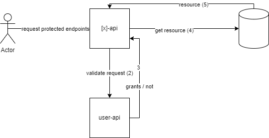
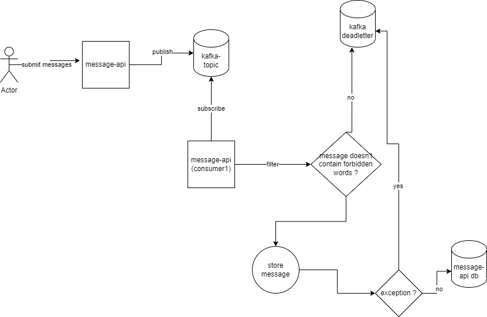

## Overview

This repository contains `application` to solve required task given.

Inside this repository, I try to simulate using `monorepo`

Here is the structure

```
rakuten-mobile-test/
 - docker-compose.yml
 - apps/
   - user-api
   - message-api
```

Notes:

- apps/ is a directory where our application resides.
- docker-compose.yml can be used to provide integrated image build.
- It is still simple and intended for demonstration purpose only.

Each of apps have already used OpenAPI 3 standards. You can find `yaml` definition in directory `specs/`

Also each of apps have used reactive programming using `project-reactor`

Also on each startup, all the applications will try to run migration. I use liquibase.

## Components

These projects are largely composed from"

- Spring webflux
- project-reactor
- maven
- OpenAPI
- Liquibase

## How to run

Just run

`docker-compose up -d --build`

Postman collection:

[user-api](https://www.getpostman.com/collections/c1dbcf01de90ba3209aa)

[message-api](https://www.getpostman.com/collections/11e6d0861b599ee700e5)

Authorization:

Basic Auth

apps will be served on HTTP port:

- user-api
    - 8080
- message-api
    - 8082
- message-api db
    - 5433
- rakuten_mobile_test db (user-api)
    - 5432
- kafka
    - bootstrap-servers: 29093
    - zookeeper: localhost:22181
    - topic: send-message-docker
    - dlt: send-message-deadletter

Please look into apps/[x]/resources/application.properties

for the configuration available.

## apps

There are two `applications`

- user-api
- message-api

apps has rest-api. They are built using reactive system.

Each of apps support common rest code. One important thing, if `5xx` happens, we hide the actual error message (need to refer to log).

### user-api

This is an application / service that is responsible in managing the user. It provides two endpoints

- Register
- Validate
    - Basic Auth

Each of application that employs user authentication needs to validate the account using this service.

High level flow will be like this:



- User requests to [x]-api where x is the target service
- In [x]-api, the request will be validated to user-api
- user-api will return
    - 401, invalid credentials
    - 400, invalid params
    - 500 otherwise

### message-api

`message-api` has responsibility to manage user messages.

Message is an entity which has following properties:

- id (uuid)
- user_id (STRING)
- topic (string)
- content (string)
- created_at (TIMESTAMP TZ)

The reason why `id` uses `UUID` type is because I thought about scalability where if we in the future want to use distributed database, we could avoid hot spot and introduce randomness.

Operations supported:

- Submit messages by user
    - async operation
        - publish to kafka topic
        - consume
- List messages
    - filter
        - topic
        - user_id
- Get message by Id
- Delete message
    - checks if message belongs to user requested.


#### Flow

- Submit messages



- Submitting messages

    - on each message, it will be published separately
    - there is no transaction guarantee.
        - We could but it is out of scope from this initial project I think.
    - Filter each message
        - if contains badwords, send to deadletter (we may use different topics for this)
        - store to db
            - exception happens
                - retry 3 times
                    - send to deadletter

- Delete message
    - Only delete message where message.user_id == user.id

## Todo

I don't have so much time when doing this. So there is still lots of possibilities to improve this

- [ ] Integration test
- [ ] replay for deadletter

**Please open issue if you found something wrong**
